<!-- START doctoc generated TOC please keep comment here to allow auto update -->
<!-- DON'T EDIT THIS SECTION, INSTEAD RE-RUN doctoc TO UPDATE -->
**Table of Contents**  *generated with [DocToc](https://github.com/thlorenz/doctoc)*

- [深入浅出微前端](#%E6%B7%B1%E5%85%A5%E6%B5%85%E5%87%BA%E5%BE%AE%E5%89%8D%E7%AB%AF)
  - [背景](#%E8%83%8C%E6%99%AF)
  - [什么是微前端](#%E4%BB%80%E4%B9%88%E6%98%AF%E5%BE%AE%E5%89%8D%E7%AB%AF)
    - [微前端优势](#%E5%BE%AE%E5%89%8D%E7%AB%AF%E4%BC%98%E5%8A%BF)
    - [微前端解决方案](#%E5%BE%AE%E5%89%8D%E7%AB%AF%E8%A7%A3%E5%86%B3%E6%96%B9%E6%A1%88)
  - [为什么不是TA](#%E4%B8%BA%E4%BB%80%E4%B9%88%E4%B8%8D%E6%98%AFta)
    - [为什么不是 iframe](#%E4%B8%BA%E4%BB%80%E4%B9%88%E4%B8%8D%E6%98%AF-iframe)
    - [为什么不是 Web Component](#%E4%B8%BA%E4%BB%80%E4%B9%88%E4%B8%8D%E6%98%AF-web-component)
    - [为什么不是ESM](#%E4%B8%BA%E4%BB%80%E4%B9%88%E4%B8%8D%E6%98%AFesm)
  - [SingleSpa](#singlespa)
    - [SystemJS使用](#systemjs%E4%BD%BF%E7%94%A8)
      - [新建项目并配置](#%E6%96%B0%E5%BB%BA%E9%A1%B9%E7%9B%AE%E5%B9%B6%E9%85%8D%E7%BD%AE)
      - [编写js、html代码](#%E7%BC%96%E5%86%99jshtml%E4%BB%A3%E7%A0%81)
      - [查看dest目录](#%E6%9F%A5%E7%9C%8Bdest%E7%9B%AE%E5%BD%95)
    - [SystemJS原理](#systemjs%E5%8E%9F%E7%90%86)
      - [核心方法-register](#%E6%A0%B8%E5%BF%83%E6%96%B9%E6%B3%95-register)
      - [核心方法-import](#%E6%A0%B8%E5%BF%83%E6%96%B9%E6%B3%95-import)
    - [SingleSpa使用](#singlespa%E4%BD%BF%E7%94%A8)
      - [创建基座](#%E5%88%9B%E5%BB%BA%E5%9F%BA%E5%BA%A7)
      - [创建vue项目](#%E5%88%9B%E5%BB%BAvue%E9%A1%B9%E7%9B%AE)
      - [创建react项目](#%E5%88%9B%E5%BB%BAreact%E9%A1%B9%E7%9B%AE)
      - [启动项目](#%E5%90%AF%E5%8A%A8%E9%A1%B9%E7%9B%AE)
    - [SingleSpa原理](#singlespa%E5%8E%9F%E7%90%86)
      - [原生Demo](#%E5%8E%9F%E7%94%9Fdemo)
      - [核心方法-registerApplication](#%E6%A0%B8%E5%BF%83%E6%96%B9%E6%B3%95-registerapplication)
      - [状态机](#%E7%8A%B6%E6%80%81%E6%9C%BA)
      - [核心方法-start](#%E6%A0%B8%E5%BF%83%E6%96%B9%E6%B3%95-start)
      - [核心逻辑-reroute](#%E6%A0%B8%E5%BF%83%E9%80%BB%E8%BE%91-reroute)
      - [完善核心逻辑-reroute](#%E5%AE%8C%E5%96%84%E6%A0%B8%E5%BF%83%E9%80%BB%E8%BE%91-reroute)
    - [SingleSpa小结](#singlespa%E5%B0%8F%E7%BB%93)
  - [qiankun](#qiankun)
    - [qiankun使用](#qiankun%E4%BD%BF%E7%94%A8)
      - [提供基座](#%E6%8F%90%E4%BE%9B%E5%9F%BA%E5%BA%A7)
      - [提供Vue子应用](#%E6%8F%90%E4%BE%9Bvue%E5%AD%90%E5%BA%94%E7%94%A8)
      - [提供React子应用](#%E6%8F%90%E4%BE%9Breact%E5%AD%90%E5%BA%94%E7%94%A8)
      - [查看最终效果](#%E6%9F%A5%E7%9C%8B%E6%9C%80%E7%BB%88%E6%95%88%E6%9E%9C)
    - [qiankun原理](#qiankun%E5%8E%9F%E7%90%86)
      - [registerMicroApps](#registermicroapps)
      - [start](#start)
      - [prefetch](#prefetch)
      - [loadApp](#loadapp)
      - [createSandboxContainer](#createsandboxcontainer)

<!-- END doctoc generated TOC please keep comment here to allow auto update -->

# 深入浅出微前端

- 背景？
- 什么是微前端？
- 对比各方案优缺点？
- systemjs是什么？
- single-spa使用和原理？
- qiankun使用和原理？
- umi-qiankun如何工作？
- webpack5 module federation是什么？
- emp实践
- 智慧案场微前端方案
  - 架构设计？umi-qiankun
  - 子产品接入指南？
  - 如何借助@focus/cli更好的工作？
  - @focus/pro-com

## 背景

在微前端出现之前，一个系统的前端开发模式基本都是单仓库，包含了所有的功能、代码...

很多企业也基本在物理上进行了应用代码隔离，实行单个应用单个库，闭环部署更新测试环境和正式环境。

比如我们公司的权限管理后台，首页中罗列了各个系统的入口，每个系统由单独仓库管理，点击具体系统，打开新窗口进行访问。

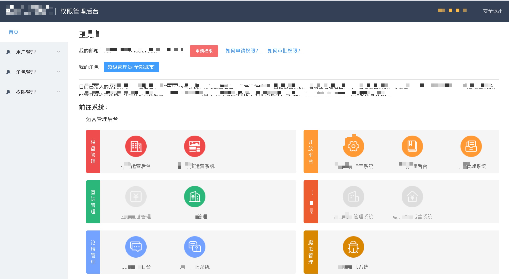

由于多个应用一级域名一致，使用不同二级域名区分。`cookie`存放在一级域名下，所以各应用可以借此实现用户信息的一致性。但是对于**头部、左侧菜单**通用的模块，以及多个应用之间如何实现资源共享？

我们尝试采用**npm包形式**对**头部、左侧菜单**抽离成npm包的形式进行管理和使用。但是却带来了**发布效率低下**的问题；

> 如果需要迭代npm包内的逻辑业务，需要先发布npm包之后，再每个使用了该npm包的应用都更新一次npm包版本，再各自构建发布一次，过程繁琐。如果涉及到的应用更多的话，花费的人力和精力就更多了。

不仅如此，我们可能还有下面几个诉求：

- 不同团队间开发同一个应用技术栈不同怎么办？
- 希望每个团队都可以独立开发，独立部署怎么办？（上述方式虽然可以解决，但是体验不好）
- 项目中还需要老的应用代码怎么办？

## 什么是微前端

在2016年，微前端的概念诞生。[micro-frontends](https://micro-frontends.org/)中定义`Techniques, strategies and recipes for building a modern web app with multiple teams that can ship features independently.`翻译成中文为`用来构建能够让 多个团队 独立交付项目代码的 现代web app 技术，策略以及实践方法`。

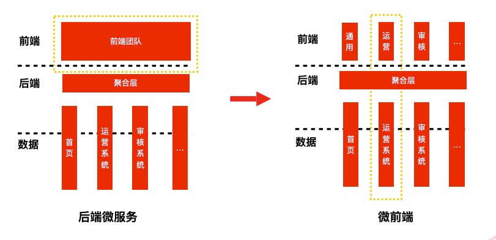

微前端也是借鉴后端微服务的思想。微前端就是将不同的功能按照不同的纬度拆分成多个子应用。通过主应用来加载这些子应用。

微前端的核心在于**先拆后合**。

### 微前端优势

- 同步更新
- 增量升级
- 简单、解耦的代码库
- 独立开发、部署

### 微前端解决方案

- 基座模式：通过搭建基座、配置中心来管理子应用。如基于`single spa`的`qiankun`方案。
- 自组织模式：通过约定进行互相调用，但会遇到处理第三方依赖的问题。
- 去中心模式：脱离基座模式，每个应用之间都可以批次分享资源。如基于`webpack5 module federation`实现的`EMP微前端方案`，可以实现多个应用彼此共享资源。


## 为什么不是TA
### 为什么不是 iframe

`qiankun技术圆桌`中有一篇关于微前端[Why Not Iframe](https://www.yuque.com/kuitos/gky7yw/gesexv)的思考，下面贴一下`iframe`的优缺点

- iframe 提供了浏览器原生的硬隔离方案，不论是样式隔离、 js 隔离这类问题统统都能被完美解决。
- url 不同步。浏览器刷新 iframe url 状态丢失、后退前进按钮无法使用。
- UI 不同步，DOM 结构不共享。想象一下屏幕右下角 1/4 的 iframe 里来一个带遮罩层的弹框，同时我们要求这个弹框要浏览器居中显示，还要浏览器 resize 时自动居中..
- 全局上下文完全隔离，内存变量不共享。iframe 内外系统的通信、数据同步等需求，主应用的 cookie 要透传到根域名都不同的子应用中实现免登效果。
- 慢。每次子应用进入都是一次浏览器上下文重建、资源重新加载的过程。

因为这些原因，最终大家都舍弃了 iframe 方案。

### 为什么不是 Web Component

[MDN Web Components](https://developer.mozilla.org/zh-CN/docs/Web/Web_Components)由三项主要技术组成，它们可以一起使用来创建封装功能的定制元素，可以在你喜欢的任何地方重用，不必担心代码冲突。

- **Custom elements（自定义元素）**：一组JavaScript API，允许您定义custom elements及其行为，然后可以在您的用户界面中按照需要使用它们。

- **Shadow DOM（影子DOM）**：一组JavaScript API，用于将封装的“影子”DOM树附加到元素（与主文档DOM分开呈现）并控制其关联的功能。通过这种方式，您可以保持元素的功能私有，这样它们就可以被脚本化和样式化，而不用担心与文档的其他部分发生冲突。

- **HTML templates（HTML模板）**： `<template> 和 <slot> `元素使您可以编写不在呈现页面中显示的标记模板。然后它们可以作为自定义元素结构的基础被多次重用。

官方提供的示例[web-components-examples](https://github.com/mdn/web-components-examples)。

但是兼容性很差，查看[can i use WebComponents](https://caniuse.com/?search=WebComponents)。

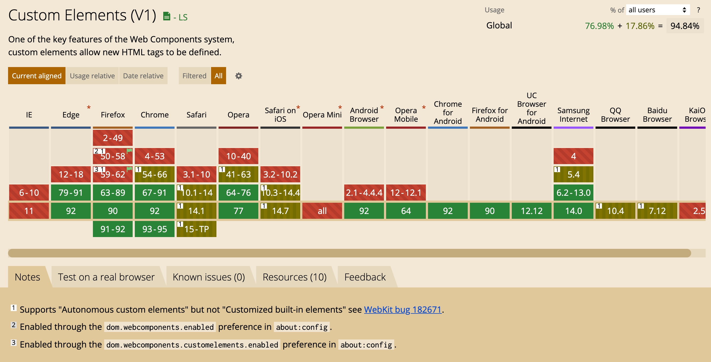

### 为什么不是ESM

`ESM`即`ES Module`，是一种前端模块化手段。他能做到微前端的几个核心点

- **无技术栈限制**： ESM加载的只是js内容，无论哪个框架，最终都要编译成js，因此，无论哪种框架，ESM都能加载。
- **应用单独开发**： ESM只是js的一种规范，不会影响应用的开发模式。
- **多应用整合**： 只要将微应用以ESM的方式暴露出来，就能正常加载。
- **远程加载模块**: ESM能够直接请求cdn资源，这是它与生俱来的能力。

但是可惜的是兼容性不好，查看[can i use import](https://caniuse.com/mdn-javascript_statements_import)。

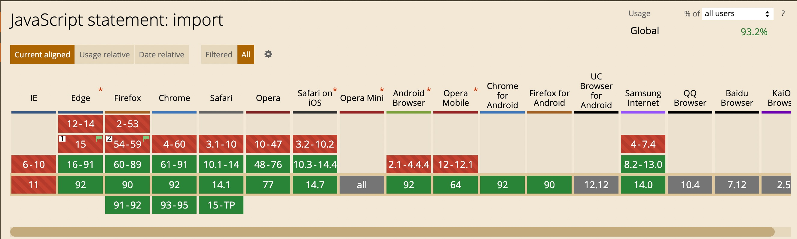

## SingleSpa

查看`single-spa`配置文件[rollup.config.js](https://github.com/single-spa/single-spa/blob/master/rollup.config.js#L44)可得知，使用了`rollup`做打包工具，并采用的`system`模块规范做输出。

> 感兴趣可查看对[@careteen/rollup](https://github.com/careteenL/rollup)的简易实现。

那我们就很有必要先介绍下`SystemJS`的相关知识。

### SystemJS使用

`SystemJS` 是一个通用的模块加载器，它能在浏览器上动态加载模块。微前端的核心就是加载微应用，我们将应用打包成模块，在浏览器中通过 `SystemJS` 来加载模块。

> 下方示例存放在[@careteen/micro-fe/system.js](https://github.com/careteenL/micro-fe/tree/master/system.js)，感兴趣可以前往调试。

#### 新建项目并配置

安装依赖

```shell
$ mkdir system.js
$ yarn init
$ yarn add webpack webpack-cli webpack-dev-server babel-loader @babel/core @babel/preset-env @babel/preset-react html-webpack-plugin -D
$ yarn add react react-dom
```

配置`webpack.config.js`文件，采用`system.js`模块规范作为`output.libraryTarget`，并不打包`react/react-dom`。

```js
const path = require("path");
const HtmlWebpackPlugin = require("html-webpack-plugin");
module.exports = (env) => {
  return {
    mode: "development",
    output: {
      filename: "index.js",
      path: path.resolve(__dirname, "dest"),
      libraryTarget: env.production ? "system" : "",
    },
    module: {
      rules: [
        {
          test: /\.js$/,
          use: { loader: "babel-loader" },
          exclude: /node_modules/,
        },
      ],
    },
    plugins: [
      !env.production &&
        new HtmlWebpackPlugin({
          template: "./public/index.html",
        }),
    ].filter(Boolean),
    externals: env.production ? ["react", "react-dom"] : [],
  };
};
```

配置`.babelrc`文件

```json
{
  "presets":[
    "@babel/preset-env",
    "@babel/preset-react"
  ]
}
```

配置`package.json`文件

```json
"scripts": {
  "dev": "webpack serve",
  "build": "webpack --env production"
},
```

#### 编写js、html代码

新建`src/index.js`入口文件

```js
import React from 'react';
import ReactDOM from 'react-dom';

ReactDOM.render(
  <h1>hello system.js</h1>,
  document.getElementById('root')
)
```

新建`public/index.html`文件，以cdn的形式引入`system.js`，并且将`react/react-dom`作为前置依赖配置到`systemjs-importmap`中。

```html
<!DOCTYPE html>
<html lang="en">
  <head>
    <meta charset="UTF-8" />
    <meta http-equiv="X-UA-Compatible" content="IE=edge" />
    <meta name="viewport" content="width=device-width, initial-scale=1.0" />
    <title>system.js demo</title>
  </head>

  <body>
    <script type="systemjs-importmap">
      {
        "imports": {
          "react": "https://cdn.bootcdn.net/ajax/libs/react/17.0.2/umd/react.production.min.js",
          "react-dom": "https://cdn.bootcdn.net/ajax/libs/react-dom/17.0.2/umd/react-dom.production.min.js"
        }
      }
    </script>
    <div id="root"></div>
    <script src="https://cdn.bootcdn.net/ajax/libs/systemjs/6.10.1/system.min.js"></script>
    <script>
      System.import("./index.js").then(() => {});
    </script>
  </body>
</html>
```

然后命令行运行

```shell
$ npm run dev # or build
```

打开浏览器访问，可正常显示文本。

#### 查看dest目录

观察`dest/index.js`文件，可发现通过`system.js`打包后会根据`webpack`配置而先`register`预加载`react/react-dom`然后返回`execute`执行函数。

```js
System.register(["react","react-dom"], function(__WEBPACK_DYNAMIC_EXPORT__, __system_context__) {
  return {
    setters: [
      // ...
    ],
    execute: function() {
      // ...
    }
  };
});
```

并且我们在使用时是通过`System.import("./index.js").then(() => {});`这个形式。

基于上述观察，我们了解到`system.js`两个核心`api`

- System.import ：加载入口文件
- System.register ：预加载

下面将做个简易实现。

### SystemJS原理

> 下方实现原理代码存放在[@careteen/micro-fe/system.js/dest/index.html](https://github.com/careteenL/micro-fe/blob/master/system.js/dest/index.html)，感兴趣可以前往调试。

首先提供构造函数，并将`window`的属性存一份，目的是查找对`window`属性进行的修改。

```js
function SystemJS() {}
let set = new Set();
const saveGlobalPro = () => {
  for (let p in window) {
    set.add(p);
  }
};
const getGlobalLastPro = () => {
  let result;
  for (let p in window) {
    if (set.has(p)) continue;
    result = window[p];
    result.default = result;
  }
  return result;
};

saveGlobalPro();
```

#### 核心方法-register

实现`register`方法，主要是对前置依赖做存储，方便后面加载文件时取值加载。

```js
let lastRegister;
SystemJS.prototype.register = function (deps, declare) {
  // 将本次注册的依赖和声明 暴露到外部
  lastRegister = [deps, declare];
};
```

使用`JSONP`提供`load`创建`script`脚本函数。

```js
function load(id) {
  return new Promise((resolve, reject) => {
    const script = document.createElement("script");
    script.src = id;
    script.async = true;
    document.head.appendChild(script);
    script.addEventListener("load", function () {
      // 加载后会拿到 依赖 和 回调
      let _lastRegister = lastRegister;
      lastRegister = undefined;

      if (!_lastRegister) {
        resolve([[], function () {}]); // 表示没有其他依赖了
      }
      resolve(_lastRegister);
    });
  });
}
```

#### 核心方法-import

实现`import`方法，传参为`id`即入口文件，加载入口文件后，解析[查看dest目录](#查看dest目录)中的`setters和execute`。

由于`react` 和 `react-dom` 会给全局增添属性 `window.React`,`window.ReactDOM`属性，所以可以通过`getGlobalLastPro`获取到这些新增的依赖库。

```js
SystemJS.prototype.import = function (id) {
  return new Promise((resolve, reject) => {
    const lastSepIndex = window.location.href.lastIndexOf("/");
    const baseURL = location.href.slice(0, lastSepIndex + 1);
    if (id.startsWith("./")) {
      resolve(baseURL + id.slice(2));
    }
  }).then((id) => {
    let exec;
    // 可以实现system模块递归加载
    return load(id)
      .then((registerition) => {
        let declared = registerition[1](() => {});
        // 加载 react 和 react-dom  加载完毕后调用setters
        // 调用执行函数
        exec = declared.execute;
        return [registerition[0], declared.setters];
        // {setters:[],execute:function(){}}
      })
      .then((info) => {
        return Promise.all(
          info[0].map((dep, i) => {
            var setter = info[1][i];
            // react 和 react-dom 会给全局增添属性 window.React,window.ReactDOM
            return load(dep).then((r) => {
              // console.log(r);
              let p = getGlobalLastPro();
              // 这里如何获取 react和react-dom?
              setter(p); // 传入加载后的文件
            });
          })
        );
      })
      .then(() => {
        exec();
      });
  });
};
```

上述简单实现了`system.js`的核心方法，可注释掉cdn引入形式，使用自己实现的进行测试，可正常展示。

```js
let System = new SystemJS();
System.import("./index.js").then(() => {});
```

### SingleSpa使用

> 下方示例代码存放在[@careteen/micro-fe/single-spa](https://github.com/careteenL/micro-fe/tree/master/single-spa)，感兴趣可以前往调试。

安装脚手架，方便快速创建应用。
```shell
$ npm i -g create-single-spa
```
#### 创建基座

```shell
$ create-single-spa base
```

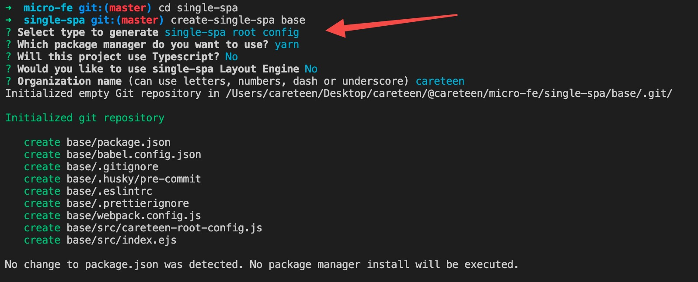

在`src/careteen-root-config.js`文件中新增下面子应用配置

```js
registerApplication({
  name: "@careteen/vue", // 应用名字
  app: () => System.import("@careteen/vue"), // 加载的应用
  activeWhen: ["/vue"], // 路径匹配
  customProps: {
    name: 'single-spa-base',
  },
});

registerApplication({
  name: "@careteen/react",
  app: () => System.import("@careteen/react"),
  activeWhen: ["/react"],
  customProps: {
    name: 'single-spa-base',
  },
});
start({
  urlRerouteOnly: true, // 全部使用SingleSpa中的reroute管理路由
});
```

提供`registerApplication`方法注册并加载应用，`start`方法启动应用

查看`src/index.ejs`文件

```html
<script type="systemjs-importmap">
  {
    "imports": {
      "single-spa": "https://cdn.jsdelivr.net/npm/single-spa@5.9.0/lib/system/single-spa.min.js"
    }
  }
</script>
<link rel="preload" href="https://cdn.jsdelivr.net/npm/single-spa@5.9.0/lib/system/single-spa.min.js" as="script">

<script>
  System.import('@careteen/root-config');
</script>
```

可得知需要`single-spa`作为前置依赖，并且实现`preload`预加载，最后加载基座应用`System.import('@careteen/root-config');`。

下面继续使用脚手架创建子应用

#### 创建vue项目

```shell
$ create-single-spa slave-vue
```

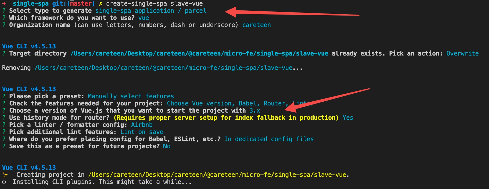

此处选择`vue3.x`版本。新建`vue.config.js`配置文件，配置开发端口号为`3000`

```js
module.exports = {
  devServer: {
    port: 3000,
  },
}
```

还需要修改`src/router/index.js`

```js
const router = createRouter({
  history: createWebHistory('/vue'),
  routes,
});
```

在基座中配置

```html
<script type="systemjs-importmap">
  {
    "imports": {
      "@careteen/root-config": "//localhost:9000/careteen-root-config.js",
      "@careteen/slave-vue": "//localhost:3000/js/app.js"
    }
  }
</script>
```

#### 创建react项目

```shell
$ create-single-spa slave-react
```


修改开发端口号为`4000`

```json
"scripts": {
  "start": "webpack serve --port 4000",
}
```

创建下面路由

```js
import { BrowserRouter as Router, Route, Link, Switch, Redirect } from 'react-router-dom'
import Home from './components/Home.js'
import About from './components/About.js'

export default function Root(props) {
  return <Router basename="/react">
    <div>
      <Link to="/">Home React</Link>
      <Link to="/about">About React</Link>
    </div>
    <Switch>
      <Route path="/"  exact={true} component={Home}></Route>
      <Route path="/about" component={About}></Route>
      <Redirect to="/"></Redirect>
    </Switch>
  </Router>
}
```

在基座中配置`react/react-dom`以及`@careteen/react`

```html
<script type="systemjs-importmap">
  {
    "imports": {
      "single-spa": "https://cdn.jsdelivr.net/npm/single-spa@5.9.0/lib/system/single-spa.min.js",
      "react":"https://cdn.bootcdn.net/ajax/libs/react/17.0.2/umd/react.production.min.js",
      "react-dom":"https://cdn.bootcdn.net/ajax/libs/react-dom/17.0.2/umd/react-dom.production.min.js"        
    }
  }
</script>
<script type="systemjs-importmap">
  {
    "imports": {
      "@careteen/root-config": "//localhost:9000/careteen-root-config.js",
      "@careteen/slave-vue": "//localhost:3000/js/app.js",
      "@careteen/react": "//localhost:4000/careteen-react.js"
    }
  }
</script>
```

#### 启动项目

```shell
$ cd base && yarn start
$ cd ../slave-vue && yarn start
$ cd ../slave-react && yarn start
```

浏览器打开 http://localhost:9000/

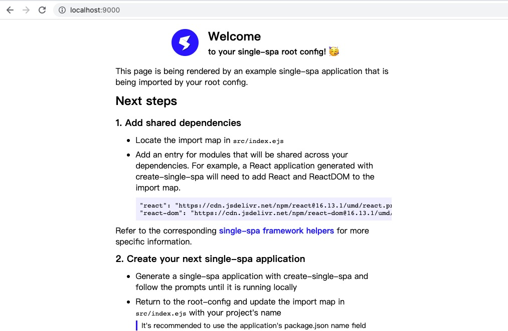

手动输入 http://localhost:9000/vue/ 并可以切换路由

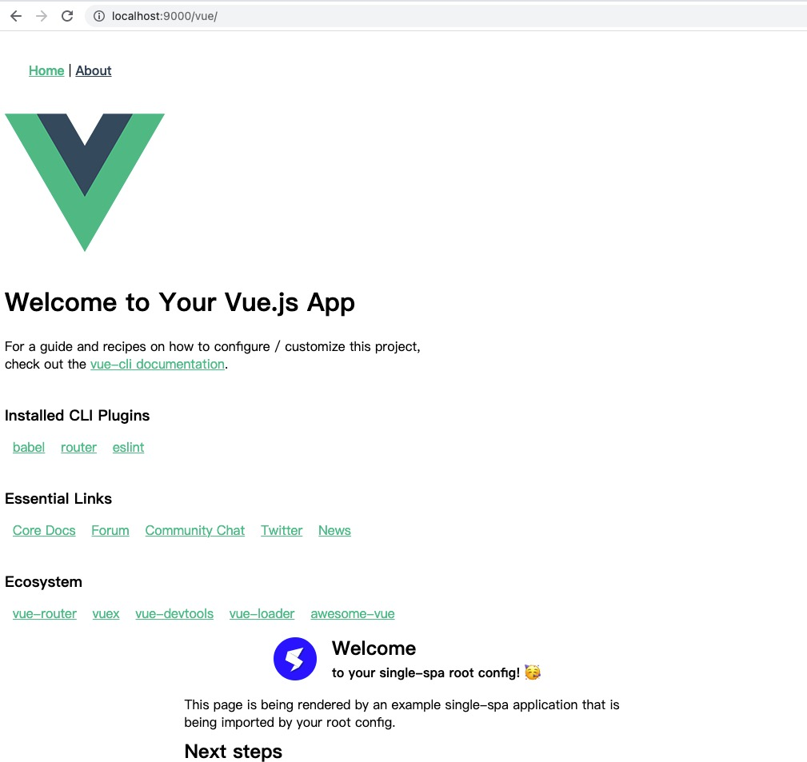

手动输入 http://localhost:9000/react/ 并可以切换路由

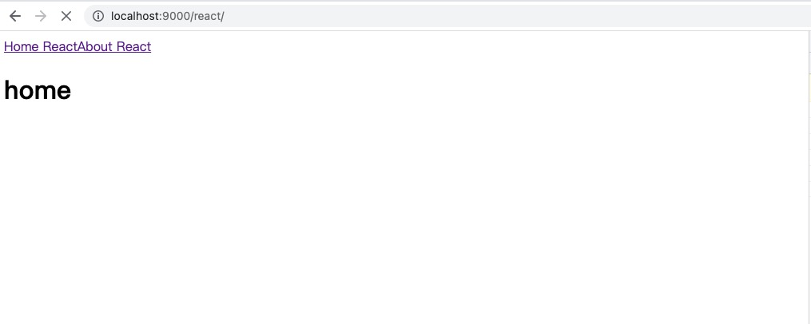

### SingleSpa原理

> 下方原理实现代码存放在[@careteen/micro-fe/single-spa/single-spa](https://github.com/careteenL/micro-fe/tree/master/single-spa/single-spa)，感兴趣可以前往调试。

从`single spa`使用中，可以发现主要是两个方法`registerApplication`和`start`。

先新建`single-spa/example/index.html`文件，使用cdn的形式使用`single-spa`

#### 原生Demo

```html
<!DOCTYPE html>
<html lang="en">
  <head>
    <meta charset="UTF-8" />
    <meta http-equiv="X-UA-Compatible" content="IE=edge" />
    <meta name="viewport" content="width=device-width, initial-scale=1.0" />
    <title>my single spa demo</title>
    <script src="https://cdn.bootcdn.net/ajax/libs/single-
spa/5.9.3/umd/single-spa.min.js"></script>
  </head>

  <body>
    <!-- 切换导航加载不同的应用 -->
    <a href="#/a">a应用</a>
    <a href="#/b">b应用</a>
    <!-- 源码中single-spa 是用rollup打包的 -->
    <script type="module">
      const { registerApplication, start } = singleSpa;
      // 接入协议
      let app1 = {
        bootstrap: [
          // 这东西只执行一次 ，加载完应用，不需要每次都重复加载
          async (customProps) => {
            // koa中的中间件 vueRouter4 中间件
            console.log("app1 启动~1", customProps);
          },
          async () => {
            console.log("app1 启动~2");
          },
        ],
        mount: async (customProps) => {
          console.log("app1 mount");
        },
        unmount: async (customProps) => {
          console.log("app1 unmount");
        },
      };
      let app2 = {
        bootstrap: [
          async () => {
            console.log("app2 启动~1");
          },
          async () => {
            console.log("app2 启动~2");
          },
        ],
        mount: async () => {
          console.log("app2 mount");
        },
        unmount: async () => {
          console.log("app2 unmount");
        },
      };

      const customProps = { name: "single spa" };
      // 注册微应用
      registerApplication(
        "app1", // 这个名字可以用于过滤防止加载重复的应用
        async () => {
          return app1;
        },
        (location) => location.hash == "#/a",
        customProps
      );
      registerApplication(
        "app2", // 这个名字可以用于过滤防止加载重复的应用
        async () => {
          return app2;
        },
        (location) => location.hash == "#/b",
        customProps
      );

      start();
    </script>
  </body>
</html>
```

对`package.json`做如下配置

```json
"scripts": {
  "dev": "http-server -p 5000"
}
```

然后运行

```shell
$ cd single-spa
$ yarn
$ yarn dev
```

打开 http://127.0.0.1:5000/example 点击切换a b应用查看打印结果

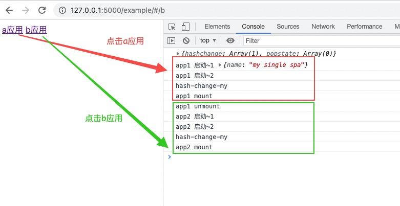

#### 核心方法-registerApplication

接着去实现核心方法

新建`single-spa/src/single-spa.js`

```js
export { registerApplication } from './applications/apps.js';
export { start } from './start.js';
```

新建`single-spa/src/applications/app.js`

```js
import { reroute } from "../navigation/reroute.js";
import { NOT_LOADED } from "./app.helpers.js";

export const apps = [];
export function registerApplication(appName, loadApp, activeWhen, customProps) {
  const registeration = {
    name: appName,
    loadApp,
    activeWhen,
    customProps,
    status: NOT_LOADED,
  };
  apps.push(registeration);
  reroute();
}
```

维护数组`apps`存放所有的子应用，每个子应用需要的传参如下

- appName: 应用名称
- loadApp: 应用的加载函数 此函数会返回 bootstrap  mount unmount
- activeWhen: 当前什么时候激活 location => location.hash == '#/a'
- customProps: 用户的自定义参数
- status: 应用状态

将子应用保存到`apps`中，后续可以在数组里晒选需要的app是加载 还是 卸载 还是挂载

还需要调用`reroute`，重写路径， 后续切换路由要再次做这些事 ，这也是`single-spa`的核心。

#### 状态机

`NOT_LOADED(未加载)`为应用的默认状态，那应用还存在哪些状态呢？

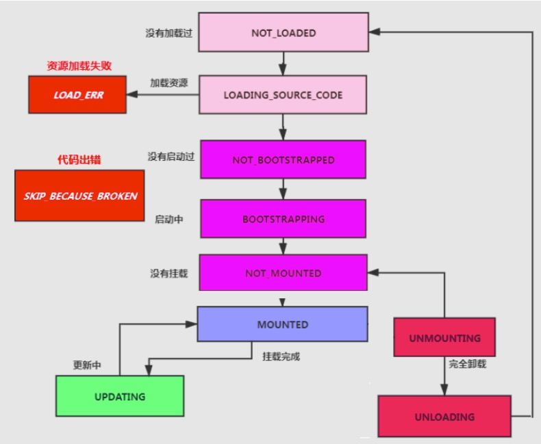

新建`single-spa/src/applications/app.helpers.js`存放所有状态

```js
export const NOT_LOADED = "NOT_LOADED"; // 应用默认状态是未加载状态
export const LOADING_SOURCE_CODE = "LOADING_SOURCE_CODE"; // 正在加载文件资源
export const NOT_BOOTSTRAPPED = "NOT_BOOTSTRAPPED"; // 此时没有调用bootstrap
export const BOOTSTRAPPING = "BOOTSTRAPPING"; // 正在启动中,此时bootstrap调用完毕后，需要表示成没有挂载
export const NOT_MOUNTED = "NOT_MOUNTED"; // 调用了mount方法
export const MOUNTED = "MOUNTED"; // 表示挂载成功
export const UNMOUNTING = "UNMOUNTING"; // 卸载中， 卸载后回到NOT_MOUNTED

// 当前应用是否被挂载了 状态是不是MOUNTED
export function isActive(app) {
  return app.status == MOUNTED;
}

// 路径匹配到才会加载应用
export function shouldBeActive(app) {
  // 如果返回的是true 就要进行加载
  return app.activeWhen(window.location);
}
```

于此同时还是提供几个方法判断当前应用所处状态。

然后再提供根据`app`状态对所有注册的app进行分类

```js
// `single-spa/src/applications/app.helpers.js`
export function getAppChanges() {
  // 拿不到所有app的？
  const appsToLoad = []; // 需要加载的列表
  const appsToMount = []; // 需要挂载的列表
  const appsToUnmount = []; // 需要移除的列表
  apps.forEach((app) => {
    const appShouldBeActive = shouldBeActive(app); // 看一下这个app是否要加载
    switch (app.status) {
      case NOT_LOADED:
      case LOADING_SOURCE_CODE:
        if (appShouldBeActive) {
          appsToLoad.push(app); // 没有被加载就是要去加载的app，如果正在加载资源 说明也没有加载过
        }
        break;
      case NOT_BOOTSTRAPPED:
      case NOT_MOUNTED:
        if (appShouldBeActive) {
          appsToMount.push(app); // 没启动柜， 并且没挂载过 说明等会要挂载他
        }
        break;
      case MOUNTED:
        if (!appShouldBeActive) {
          appsToUnmount.push(app); // 正在挂载中但是路径不匹配了 就是要卸载的
        }
      default:
        break;
    }
  });
  return { appsToLoad, appsToMount, appsToUnmount };
}

```

然后开始实现`single-spa/src/navigation/reroute.js`的核心方法

```js
import {
  getAppChanges,
} from "../applications/app.helpers.js";
export function reroute() {
  // 所有的核心逻辑都在这里
  const { appsToLoad, appsToMount, appsToUnmount } = getAppChanges();
  return loadApps();
  function loadApps() {
  // 获取所有需要加载的app,调用加载逻辑
  const loadPromises = appsToLoad.map(toLoadPromise); // 调用加载逻辑
    return Promise.all(loadPromises)
  }
}
```

于此同时再提供工具方法，方便处理传参进来的生命周期钩子是数组的场景

```js
function flattenFnArray(fns) {
  fns = Array.isArray(fns) ? fns : [fns];
  return function (customProps) {
    return fns.reduce(
      (resultPromise, fn) => resultPromise.then(() => fn(customProps),
      Promise.resolve()
    );
  };
}
```

实现原理类似于`koa中的中间件`，将多个promise组合成一个promise链。

再提供`toLoadPromise`， 只有当子应用是`NOT_LOADED` 的时候才需要加载，并使用`flattenFnArray`将各个生命周期进行处理

```js
function toLoadPromise(app) {
  return Promise.resolve().then(() => {
    if (app.status !== NOT_LOADED) {
      return app;
    }
    app.status = LOADING_SOURCE_CODE;
    return app.loadApp().then((val) => {
      let { bootstrap, mount, unmount } = val; // 获取应用的接入协议，子应用暴露的方法
      app.status = NOT_BOOTSTRAPPED;
      app.bootstrap = flattenFnArray(bootstrap);
      app.mount = flattenFnArray(mount);
      app.unmount = flattenFnArray(unmount);

      return app;
    });
  });
}
```

#### 核心方法-start

然后实现`single-spa/src/start.js`

```js
import { reroute } from "./navigation/reroute.js";
export let started = false;
export function start() {
  started = true; // 开始启动了
  reroute();
}
```

#### 核心逻辑-reroute

接着需要对`reroute`方法进行完善，将不需要的组件全部卸载，将需要加载的组件去`加载-> 启动 -> 挂载`，如果已经加载完毕，那么直接启动和挂载。

```js
export function reroute() {
  const { appsToLoad, appsToMount, appsToUnmount } = getAppChanges();
  if (started) { // 启动应用
    return performAppChanges();
  }
  function performAppChanges() { 
    appsToUnmount.map(toUnmountPromise);
    appsToLoad.map(app => toLoadPromise(app).then((app) => tryBootstrapAndMount(app)))
    appsToMount.map(appToMount => tryBootstrapAndMount(appToMount))
  }
}
```

其核心就是**卸载需要卸载的应用-> 加载应用 -> 启动应用 -> 挂载应用**


然后提供`toUnmountPromise`，标记成正在卸载，调用卸载逻辑 ， 并且标记成 未挂载。

```js
function toUnmountPromise(app) {
  return Promise.resolve().then(() => {
    // 如果不是挂载状态 直接跳出
    if (app.status !== MOUNTED) {
      return app;
    }
    app.status = UNMOUNTING;
    return app.unmount(app.customProps).then(() => {
      app.status = NOT_MOUNTED;
    });
  });
}
```

以及`tryBootstrapAndMount`，提供`a/b`应用的切换

```js
// a -> b b->a a->b
function tryBootstrapAndMount(app, unmountPromises) {
  return Promise.resolve().then(() => {
    if (shouldBeActive(app)) {
      return toBootStrapPromise(app).then((app) =>
        unmountPromises.then(() => {
          capturedEventListeners.hashchange.forEach((item) => item());
          return toMountPromise(app);
        })
      );
    }
  });
}
```

实现`toBootStrapPromise`启动应用

```js
function toBootStrapPromise(app) {
  return Promise.resolve().then(() => {
    if (app.status !== NOT_BOOTSTRAPPED) {
      return app;
    }
    app.status = BOOTSTRAPPING;
    return app.bootstrap(app.customProps).then(() => {
      app.status = NOT_MOUNTED;
      return app;
    });
  });
}
```

实现`toMountPromise`加载应用

```js
function toMountPromise(app) {
  return Promise.resolve().then(() => {
    if (app.status !== NOT_MOUNTED) {
      return app;
    }
    return app.mount(app.customProps).then(() => {
      app.status = MOUNTED;
      return app;
    });
  });
}
```

上述实现了子应用各个状态的切换逻辑，下面还需要将路由进行重写。

新建`single-spa/src/navigation/navigation-events.js`，监听hashchange和popstate，路径变化时重新初始化应用。

```js
import { reroute } from "./reroute.js";

function urlRoute() {
  reroute();
}
window.addEventListener("hashchange", urlRoute);
window.addEventListener("popstate", urlRoute);
```

需要对浏览器的事件进行拦截，其实现方式和`vue-router`类似，使用`AOP`的思想实现的。

因为子应用里面也可能会有路由系统，需要先加载父应用的事件，再去调用子应用。

```js
const routerEventsListeningTo = ["hashchange", "popstate"];
export const capturedEventListeners = {
  hashchange: [],
  popstate: [],
};
const originalAddEventListener = window.addEventListener;
const originalRemoveEventLister = window.removeEventListener;

window.addEventListener = function (eventName, fn) {
  if (
    routerEventsListeningTo.includes(eventName) &&
    !capturedEventListeners[eventName].some((l) => fn == l)
  ) {
    return capturedEventListeners[eventName].push(fn);
  }
  return originalAddEventListener.apply(this, arguments);
};

window.removeEventListener = function (eventName, fn) {
  if (routerEventsListeningTo.includes(eventName)) {
    return (capturedEventListeners[eventName] = capturedEventListeners[
      eventName
    ].filter((l) => fn != l));
  }
  return originalRemoveEventLister.apply(this, arguments);
};
```

需要对跳转方法进行拦截，例如 vue-router内部会通过pushState() 不改路径改状态，所以还是要处理下。如果路径不一样，也需要重启应用。


```js
function patchedUpdateState(updateState, methodName) {
  return function() {
    const urlBefore = window.location.href;
    const result = updateState.apply(this, arguments);
    const urlAfter = window.location.href;
    if (urlBefore !== urlAfter) {
      window.dispatchEvent(new PopStateEvent("popstate"));
    }
    return result;
  }
}
window.history.pushState = patchedUpdateState(window.history.pushState, 'pushState');
window.history.replaceState = patchedUpdateState(window.history.replaceState, 'replaceState')
```

提供触发事件的方法

```js
export function callCapturedEventListeners(eventArguments) { // 触发捕获的事件
  if (eventArguments) {
    const eventType = eventArguments[0].type;
    // 触发缓存中的方法
    if (routingEventsListeningTo.includes(eventType)) {
      capturedEventListeners[eventType].forEach(listener => {
        listener.apply(this, eventArguments);
      })
    }
  } 
}
```

#### 完善核心逻辑-reroute

改动`reroute`逻辑，启动完成需要调用`callAllEventListeners`，应用卸载完毕也需要调用`callAllEventListeners`。

```js
export function reroute() {
  const { appsToLoad, appsToMount, appsToUnmount } = getAppChanges();
  if (started) {
    return performAppChanges();
  }
  return loadApps();

  function loadApps() {
    const loadPromises = appsToLoad.map(toLoadPromise);
    return Promise.all(loadPromises).then(callAllEventListeners); // ++
  }
  function performAppChanges() {
    let unmountPromises = Promise.all(appsToUnmount.map(toUnmountPromise)).then(callAllEventListeners); // ++

    appsToLoad.map((app) =>
      toLoadPromise(app).then((app) =>
        tryBootstrapAndMount(app, unmountPromises)
      )
    );
    appsToMount.map((app) => tryBootstrapAndMount(app, unmountPromises));
  }
}
```

上述代码已经实现了基本功能

```shell
$ cd single-spa
$ yarn
$ yarn dev
```

打开 http://127.0.0.1:5000/example 点击切换a b应用查看打印结果，表现同[原生Demo](#原生Demo)的结果。


### SingleSpa小结

[single-spa](https://github.com/single-spa/single-spa)提供了主应用作为基座，通过路由匹配加载不同子应用的模式。具备如下优点

- **技术栈无关**： 独立开发、独立部署、增量升级、独立运行时
- **提供生命周期概念**：负责调度子应用的生命周期， 挟持 url 变化事件和函数，url 变化时匹配对应子应用，并执行生命周期流程

但是仍然存在一些问题

- **样式隔离**：子应用样式可能影响主应用，需要通过类似于`BEM`约定式方案解决。
- **JS隔离**：主子应用共用`DOM、BOM`API，例如在`window`上赋值同一个同名变量，将互相影响，也需要有隔离方案。


## qiankun

[qiankun](https://github.com/umijs/qiankun)的灵感来自并基于`single-spa`，有以下几个特点。

- **简单**: 任意 js 框架均可使用。微应用接入像使用接入一个 iframe 系统一样简单， 但实际不是 iframe 。 
- **完备**: 几乎包含所有构建微前端系统时所需要的基本能力，如 样式隔离、 js 沙箱、 预加载等。 
- **生产可用**: 已在蚂蚁内外经受过足够大量的线上系统的考验及打磨，健壮性值得信 赖。

在`single-spa`的基础上，`qiankun`还实现了如下特性

- 使用`import-html-entry`取代`system.js`加载子应用
- 提供多种样式隔离方案
- 提供多种JS隔离方案

### qiankun使用

> 下方示例代码存放在[@careteen/micro-fe/qiankun](https://github.com/careteenL/micro-fe/tree/master/qiankun)，感兴趣可以前往调试。


下面实例采用`react`作为基座，并提供一个`vue`子应用和一个`react`子应用

#### 提供基座

```shell
$ create-react-app base
$ yarn add react-router-dom qiankun
```

提供`/vue和/react`路由
```js
import { BrowserRouter as Router, Link } from "react-router-dom";
function App() {
  return (
    <div className="App">
      <Router>
        <Link to="/vue">vue应用</Link>
        <Link to="/react">react应用</Link>
      </Router>
      <div id="container"></div>
    </div>
  );
}
export default App;
```

在`src/registerApps.js`中配置两个子应用入口

```js
import { registerMicroApps, start } from "qiankun";

const loader = (loading) => {
  console.log(loading);
};
registerMicroApps(
  [
    {
      name: "slave-vue",
      entry: "//localhost:20000",
      container: "#container",
      activeRule: "/vue",
      loader,
    },
    {
      name: "slave-react",
      entry: "//localhost:30000",
      container: "#container",
      activeRule: "/react",
      loader,
    },
  ],
  {
    beforeLoad: () => {
      console.log("加载前");
    },
    beforeMount: () => {
      console.log("挂载前");
    },
    afterMount: () => {
      console.log("挂载后");
    },
    beforeUnmount: () => {
      console.log("销毁前");
    },
    afterUnmount: () => {
      console.log("销毁后");
    },
  }
);
start({
  sandbox: {
    // experimentalStyleIsolation:true
    strictStyleIsolation: true,
  },
});
```

运行命令，打开 http://localhost:3000/ 访问，下面将继续
```shell
yarn start
```

#### 提供Vue子应用

```shell
$ vue create slave-vue
```

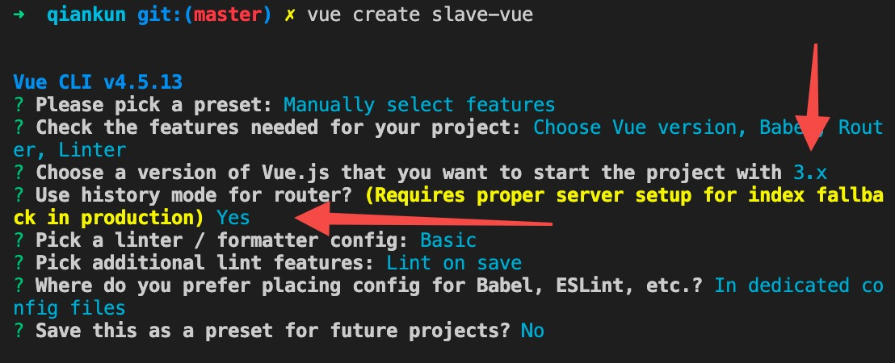


新建`vue.config.js`配置文件，设置`publicPath`保证子应用静态资源都是像20000端口上发送的，设置`headers`跨域保证父应用可以访问到。

`qiankun`没有使用`single-spa`所使用`system.js`模块规范，而打包成`umd`形式，在`qiankun`内部使用了`fetch`去加载子应用的文件内容。

```js
module.exports = {
  publicPath: '//localhost:20000', 
  devServer: {
    port: 20000,
    headers:{
      'Access-Control-Allow-Origin': '*'
    }
  },
  configureWebpack: {
    output: {
      libraryTarget: 'umd',
      library: 'slave-vue'
    }
  }
}
```

使用`qiankun`和`single-spa`类似，需要在入口文件按照约定导出特定的生命周期函数`bootstrap、mount、unmount`。

并且提供**独立访问**和**接入到主应用**两种场景。主要是借助`window.__POWERED_BY_QIANKUN__`字段判断是否在qiankun主应用下。

```js
import { createApp } from 'vue';
import { createRouter, createWebHistory } from 'vue-router';
import App from './App.vue';
import routes from './router';

let history;
let router;
let app;
function render(props = {}) {
  history = createWebHistory('/vue');
  router = createRouter({
    history,
    routes
  });
  app = createApp(App);
  let { container } = props;
  app.use(router).mount(container ? container.querySelector('#app') : '#app')
}

if (!window.__POWERED_BY_QIANKUN__) { // 独立运行自己
  render();
}

export async function bootstrap() {
  console.log('vue3 app bootstraped');
}

export async function mount(props) {
  console.log('vue3 app mount',);
  render(props)
}
export async function unmount() {
  console.log('vue3 app unmount');
  history = null;
  app = null;
  router = null;
}
```

运行命令，打开 http://localhost:20000/ 可独立访问
```shell
$ yarn serve
```

#### 提供React子应用

```shell
$ create-react-app slave-react
$ yarn add @rescripts/cli -D
```

借助`@rescripts/cli`改react的配置`.rescriptsrc.js`

输出和vue项目一样也采用`umd`模块规范。

```js
module.exports = {
  webpack:(config)=>{
    config.output.library = 'slave-react';  
    config.output.libraryTarget = 'umd';
    config.output.publicPath = '//localhost:30000/';
    return config;
  },
  devServer:(config)=>{
    config.headers = {
      'Access-Control-Allow-Origin': '*'
    };
    return config;
  }
}
```

然后在`.env`中将端口号进行修改

```shell
PORT=30000
WDS_SOCKET_PORT=30000
```

同vue子应用配置

```js
import React from 'react';
import ReactDOM from 'react-dom';
import './index.css';
import App from './App';

function render(props = {}) {
  let { container } = props;
  ReactDOM.render(<App />,
    container ? container.querySelector('#root') : document.getElementById('root')
  );
}
if (!window.__POWERED_BY_QIANKUN__) {
  render();
}
export async function bootstrap() {

}
export async function mount(props) {
  render(props)
}

export async function unmount(props) {
  const { container } = props;
  ReactDOM.unmountComponentAtNode(container ? container.querySelector('#root') : document.getElementById('root'))
}
```

`scripts`脚本需要做修改

```json
"scripts": {
  "start": "rescripts start",
  "build": "rescripts build",
  "test": "rescripts test",
  "eject": "rescripts eject"
},
```

运行命令，打开 http://localhost:30000/ 可独立访问
```shell
$ yarn start
```

#### 查看最终效果

在主应用中配置样式隔离
```js
start({
  sandbox: {
    // experimentalStyleIsolation:true
    strictStyleIsolation: true,
  },
});
```

浏览器打开 http://localhost:3000/ 点击`vue应用`

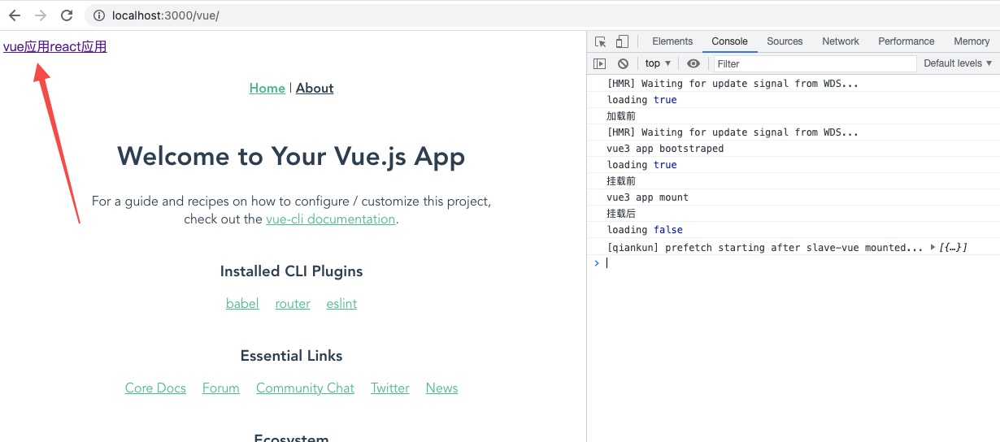

点击`react应用`，可观察父子应用样式互不影响。

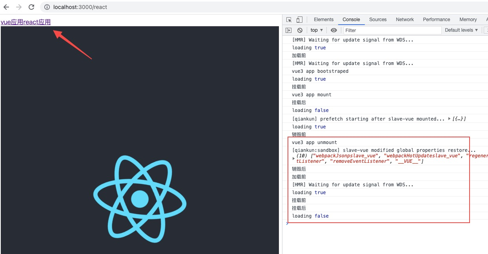

### qiankun原理

通过使用`qiankun`可观察到其`API`和`single-spa`差不多。下面将大致了解下`qiankun`的实现原理。

> 分析代码在[@careteen/qiankun](https://github.com/careteenL/qiankun)，里面有大量注释。

#### registerMicroApps

从入口注册方法`registerMicroApps`开始。

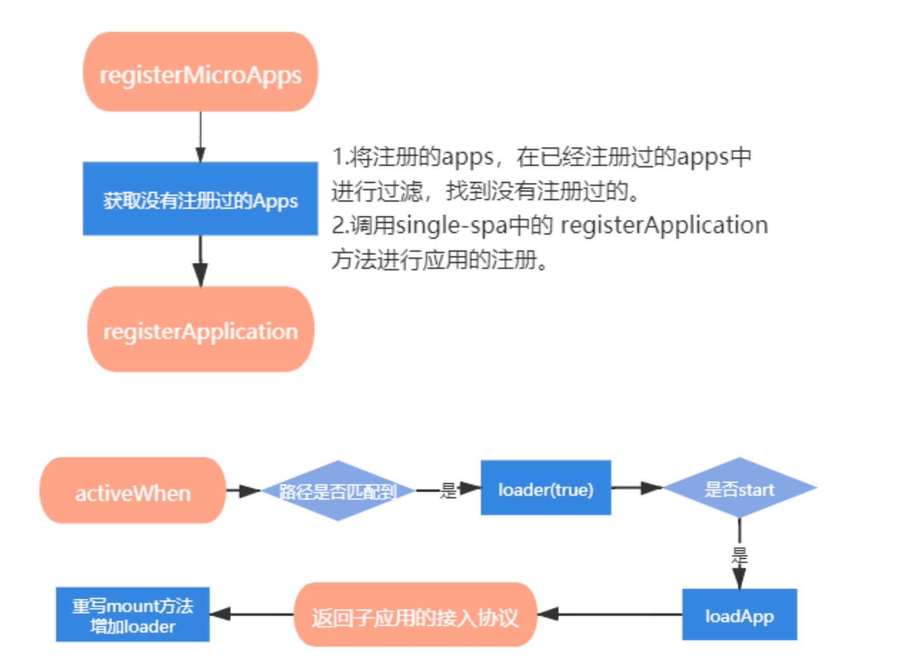

```ts

export function registerMicroApps<T extends ObjectType>(
  apps: Array<RegistrableApp<T>>, // 需要注册的应用
  lifeCycles?: FrameworkLifeCycles<T>, // 对应的生命周期
) {
  // 过滤注册重复的应用
  const unregisteredApps = apps.filter((app) => !microApps.some((registeredApp) => registeredApp.name === app.name));

  microApps = [...microApps, ...unregisteredApps];

  // 将需要注册的新应用，循环依次注册
  unregisteredApps.forEach((app) => {
    const { name, activeRule, loader = noop, props, ...appConfig } = app;

    // 实际还是调用 single-spa 的注册函数
    registerApplication({
      name,
      app: async () => {
        loader(true); // 设置 loading
        await frameworkStartedDefer.promise; // 等待 start 方法被调用

        const { mount, ...otherMicroAppConfigs } = (
          // 加载应用，获取生命周期钩子
          await loadApp({ name, props, ...appConfig }, frameworkConfiguration, lifeCycles)
        )();

        // 调用 mount 
        return {
          mount: [async () => loader(true), ...toArray(mount), async () => loader(false)],
          ...otherMicroAppConfigs,
        };
      },
      activeWhen: activeRule,
      customProps: props,
    });
  });
}
```

实际还是调用`single-spa`的注册函数`registerApplication`，只不过多做了过滤注册重复的应用。

#### start

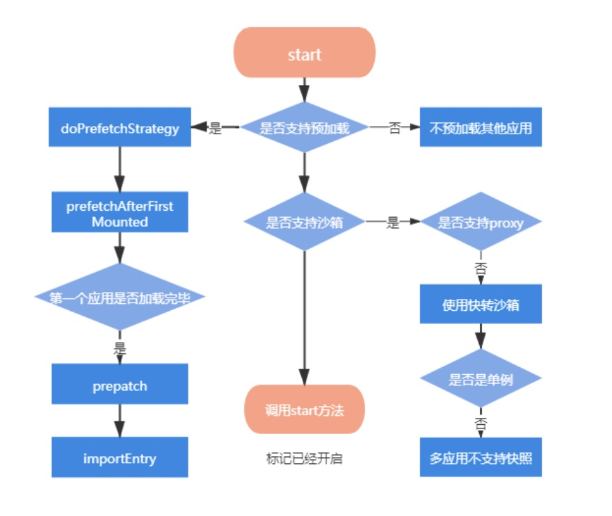

```ts
export function start(opts: FrameworkConfiguration = {}) {
  // prefetch 是否支持预加载
  // singular 是否支持单例模式
  // sandbox 是否支持沙箱
  frameworkConfiguration = { prefetch: true, singular: true, sandbox: true, ...opts };
  const {
    prefetch,
    sandbox,
    singular,
    urlRerouteOnly = defaultUrlRerouteOnly,
    ...importEntryOpts
  } = frameworkConfiguration;

  if (prefetch) { // 预加载策略
    doPrefetchStrategy(microApps, prefetch, importEntryOpts);
  }

  // 开启沙箱
  if (sandbox) {
    // 如果不支持 Proxy 则降级到快照沙箱 loose 表示使用快照沙箱
    if (!window.Proxy) {
      console.warn('[qiankun] Miss window.Proxy, proxySandbox will degenerate into snapshotSandbox');
      frameworkConfiguration.sandbox = typeof sandbox === 'object' ? { ...sandbox, loose: true } : { loose: true };
      // Proxy 下若为非单例模式 则会报错
      if (!singular) {
        console.warn(
          '[qiankun] Setting singular as false may cause unexpected behavior while your browser not support window.Proxy',
        );
      }
    }
  }

  // 启动应用，最终实际调用 single spa 的 start 方法
  startSingleSpa({ urlRerouteOnly });
  started = true;

  // 启动后，将 promise 状态改为成功态
  frameworkStartedDefer.resolve();
}
```

`qiankun`提供**预加载、单例模式、开启沙箱**配置。在开启沙箱时，会优先使用`Proxy`代理沙箱，如果浏览器不支持，则降级使用`Snapshot`快照沙箱。

在使用代理沙箱时，如果浏览器不支持`Proxy`且开启了单例模式，则会报错，因为在快照沙箱下使用单例模式会存在问题。具体下面会提到


#### prefetch

```ts
export function doPrefetchStrategy(
  apps: AppMetadata[],
  prefetchStrategy: PrefetchStrategy,
  importEntryOpts?: ImportEntryOpts,
) {
  const appsName2Apps = (names: string[]): AppMetadata[] => apps.filter((app) => names.includes(app.name));

  if (Array.isArray(prefetchStrategy)) {
    // 加载第一个应用
    prefetchAfterFirstMounted(appsName2Apps(prefetchStrategy as string[]), importEntryOpts);
  }
  // ...
}

function prefetchAfterFirstMounted(apps: AppMetadata[], opts?: ImportEntryOpts): void {
  // 监听第一个应用的
  window.addEventListener('single-spa:first-mount', function listener() {
    // 过滤所有没加载的 app
    const notLoadedApps = apps.filter((app) => getAppStatus(app.name) === NOT_LOADED);

    if (process.env.NODE_ENV === 'development') {
      const mountedApps = getMountedApps();
      console.log(`[qiankun] prefetch starting after ${mountedApps} mounted...`, notLoadedApps);
    }
    // 没加载的 app 全部需要预加载
    notLoadedApps.forEach(({ entry }) => prefetch(entry, opts));
    // 移除监听的事件
    window.removeEventListener('single-spa:first-mount', listener);
  });
}
function prefetch(entry: Entry, opts?: ImportEntryOpts): void {
  if (!navigator.onLine || isSlowNetwork) {
    // Don't prefetch if in a slow network or offline
    return;
  }
  // 使用 requestIdleCallback 在浏览器空闲时间进行预加载
  requestIdleCallback(async () => {
    // 使用 import-html-entry 进行加载资源
    // 其内部实现 是通过 fetch 去加载资源
    const { getExternalScripts, getExternalStyleSheets } = await importEntry(entry, opts);
    requestIdleCallback(getExternalStyleSheets);
    requestIdleCallback(getExternalScripts);
  });
}
```

监听第一个加载的应用：过滤所有没加载的 app，将其预加载。

使用 `requestIdleCallback` 在浏览器空闲时间进行预加载；使用 `import-html-entry` 进行加载资源，其内部实现 是通过 `fetch` 去加载资源，取代`single-spa`采用的`system.js`模块规范加载资源。

> `requestIdleCallback`在`react fiber 架构`中有使用到，感兴趣的可前往[浏览器任务调度策略和渲染流程](https://github.com/careteenL/react/tree/master/packages/fiber#%E6%B5%8F%E8%A7%88%E5%99%A8%E4%BB%BB%E5%8A%A1%E8%B0%83%E5%BA%A6%E7%AD%96%E7%95%A5%E5%92%8C%E6%B8%B2%E6%9F%93%E6%B5%81%E7%A8%8B)查看。

#### loadApp

当执行`start`方法后，会去执行`registerApplication`中的`loadApp`加载子应用。

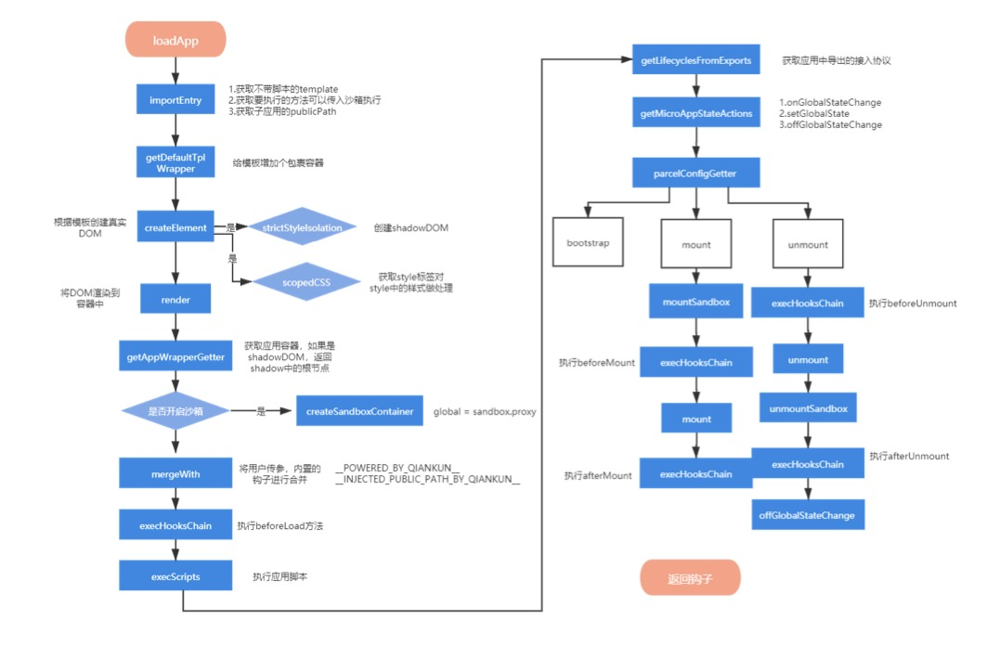

其实现代码较多，可以前往[qiankun/loader.ts/loadApp](https://github.com/careteenL/qiankun/blob/master/src/loader.ts#L244)查看实现，有注释表明大概流程。总结下来主要做了如下几件事

- 通过 `importEntry` 方法拉取子应用
- 在拉取的模板外面包一层 `div` ,增加 `css` 样式隔离，提供`shadowdom` 、 `scopedCSS`两种方式
- 将模板进行挂载
- 创建 `js` 沙箱 ,获得沙箱开启和沙箱关闭方法
- 合并出 `beforeUnmount` 、 `afterUnmount` 、 `afterMount` 、 `beforeMount` 、 `beforeLoad` 方法。增加 `qiankun` 标识
- 依次调用 `beforeLoad` 方法
- 在沙箱中执行脚本， 获取子应用的生命周期 `bootstrap` 、 `mount` 、 `unmount` `、update`
- 格式化子应用的 `mount` 方法和 `unmount` 方法。
  -  在`mount`执行前挂载沙箱、依次执行 `beforeMount` ，之后调用`mount`方法，将 全局通信方法传入。mount方法执行完毕后执行 `afterMount`
  - `unmount`方法会优先执行 `beforeUnmount` 钩子，之后开始卸载
- 增添一个 `update` 方法


#### createSandboxContainer

接下来是如何创建沙箱的实现

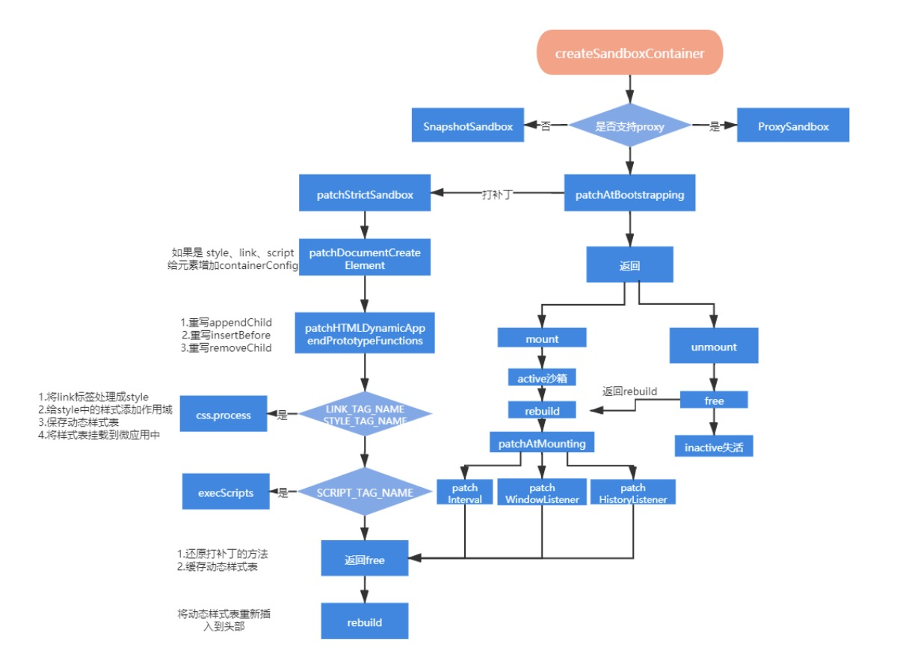

